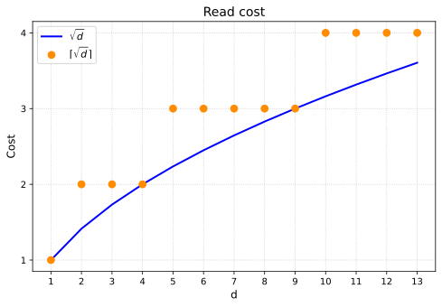
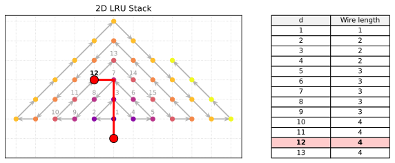

# A cost model of complexity for the 21st century: ByteDMD

Data movement matters more than FLOPs. Recently accessed bytes can be cached, penalize non-local reads using the following cost model:

$$C=\sum_{b \in bytes} \sqrt{D(b)}$$

where $D(b)$ is the depth of byte $b$ in the LRU stack. Square-root is motivated by VLSI routing cost in 2D.

## Usage

```python
from bytedmd import bytedmd

def dot(a, b):
    return sum(i1*i2 for (i1,i2) in zip(a,b))

a = [0, 1]
b = [2, 3]

# dot product
assert dot(a,b) == 3

# ByteDMD cost of dot product
assert bytedmd(dot, (a, b)) == 14
```

## Motivation


Modern architectures spend more energy moving data than doing arithmetic, making FLOP counts an outdated cost metric. Bill Dally ([ACM Opinion](https://cacm.acm.org/opinion/on-the-model-of-computation-point/)) proposed penalizing data movement based on 2D spatial distance to the processor. To avoid manual spatial mapping, Ding and Smith ([Beyond Time Complexity, 2022](https://arxiv.org/abs/2203.02536)) automated this via Data Movement Distance (DMD): a rule treating memory as an LRU stack where reading a byte at depth $d$ costs $\sqrt{d}$, modeling a cache laid out in 2D.

To avoid floating point issues, we round up to the nearest integer.



This rounding corresponds to routing wire length on a 2D grid with LRU stack arranged in the following order.



The original DMD treats values abstractly. ByteDMD counts accesses at byte level. This rewards algorithms that use smaller data types.

## Computation Model

An idealized processor operates directly on an element-level LRU stack. **Computations and writes are free; only memory reads incur a cost.**

- **Stack State:** Ordered from least recently used (bottom) to most recently used (top). Depth is measured in bytes from the top (topmost byte = depth 1). Multi-byte scalars are treated as a contiguous blocks of bytes.
- **Initialization:** On function entry, arguments are pushed to the top in call order.
- **Read Cost:** Reading a byte at depth $d$ costs $\lceil\sqrt{d}\rceil$.
- **Eviction:** A value is removed from the stack the moment it becomes garbage — i.e. when its CPython refcount drops to zero, or when the user calls `bytedmd.delete(v)` explicitly. Eviction is free. There is no other way to leave the stack.

### Instruction Semantics

See [Instruction Set](docs/instruction_set.md) for the complete list of supported instructions.

For an instruction with inputs $x_1, \dots, x_m$ and outputs $y_1, \dots, y_n$ with $m\ge 1, n\ge 0$

1. **Price reads:** Evaluate $\sum C(x_j)$ against the stack state *before* the instruction begins. Repeated inputs are charged per occurrence (e.g., `a + a` charges for reading `a` twice).
2. **Update LRU:** Move inputs to the top of the stack sequentially in read order. *(Note: Because of this sequential update, `b + c` vs. `c + b` yields the same cost but different final stack states).*
3. **Push outputs:** Allocate new output blocks and push them to the top at zero cost.

## Example Walkthrough

Consider the following function with four scalar arguments:

```python
def my_add(a, b, c, d):
    return b + c
```

**1. Initial Stack** 
Arguments are pushed in call order `[a, b, c, d]`, yielding element depths from the top:
- `d`: depth 1
- `c`: depth 2
- `b`: depth 3
- `a`: depth 4

**2. Read Cost**  
Inputs are priced simultaneously against the initial stack state:

$$C(b) + C(c) = \lceil\sqrt{3}\rceil + \lceil\sqrt{2}\rceil = 2 + 2 = 4$$

**3. Update Stack**  
Inputs move to the top sequentially in read order (`b`, then `c`), followed by the new `result` being pushed:
```text
[a, d, b, c, result]
```


## Inspecting the IR

The tracer also emits a small **intermediate representation** that makes the
LRU stack lifecycle explicit. Three event types: `STORE k` (allocate vk on
top of the stack, free), `OP name(vk@d, …)` (read each input at depth d
and LRU-bump in listed order — this is the only event that costs anything),
and `DROP k` (remove vk from the stack — emitted when CPython refcounts the
value to zero, or when the user calls `bytedmd.delete(v)` explicitly).
Op results are materialized by the `STORE` that immediately follows the `OP`.

```python
from bytedmd import inspect_ir, format_ir, bytedmd

def matvec2(A, x):
    y0 = A[0][0]*x[0] + A[0][1]*x[1]
    y1 = A[1][0]*x[0] + A[1][1]*x[1]
    return [y0, y1]

print(format_ir(inspect_ir(matvec2, ([[1,2],[3,4]], [5,6]))))
```

```text
STORE v1                                # A[0][0]
STORE v2                                # A[0][1]
STORE v3                                # A[1][0]
STORE v4                                # A[1][1]
STORE v5                                # x[0]
STORE v6                                # x[1]
OP    mul(v1@6, v5@2)  cost=5           # A[0][0]*x[0]
STORE v7
OP    mul(v2@7, v6@4)  cost=5           # A[0][1]*x[1]
STORE v8
OP    add(v7@4, v8@1)  cost=3           # y0
STORE v9
DROP  v7                                # temporary dead → refcount GC
DROP  v8
OP    mul(v3@7, v5@4)  cost=5           # A[1][0]*x[0]
STORE v10
OP    mul(v4@8, v6@5)  cost=6           # A[1][1]*x[1]
STORE v11
OP    add(v10@4, v11@1) cost=3          # y1
STORE v12
DROP  v10
DROP  v11
DROP  v12                               # function returns
DROP  v9
# total cost = 27
```

Note `OP mul(v4@8, v6@5)`: by the time the second row is evaluated, the
first row's `y0` (v9) is sitting near the top of the stack, so the unused
matrix entries `v3, v4` have been pushed deeper. This is the GC story made
explicit — depths in each `OP` event are the *actual* read depths after all
prior `PUSH`/`OP`/`DROP` events have settled the stack.

### Helping the GC: explicit `delete`

For values whose lifetime is hard for CPython to infer (loop accumulators,
slices held inside closures, numpy arrays), call `bytedmd.delete(v)` to
remove them from the stack at zero cost. This is the user-controlled
counterpart to refcount GC and is the only way to influence the stack
without rewriting the algorithm.

## ByteDMD benchmarks

See "benchmarks/" folder

### Matrix-vector (4x4 matrix, 4-vector)

| Algorithm | Operation | ByteDMD Cost |
|-----------|-----------|-------------|
| matvec (i-j) | y = A @ x | 163 |
| vecmat (j-i) | y = x^T @ A | 169 |

### Matrix multiply (4x4)

| Algorithm | Operation | ByteDMD Cost |
|-----------|-----------|-------------|
| matmul (i-j-k) | C = A @ B | 788 |
| matmul (i-k-j) | C = A @ B | 804 |
| matmul (snake-j) | C = A @ B | 743 |
| matmul (2x2 tiled) | C = A @ B | 750 |
| matmul (TSP) | C = A @ B | 741 |
| Strassen (leaf=1) | C = A @ B | 1905 |
| Winograd | C = A @ B | 1946 |

### microGPT single-token forward pass

Architecture: `vocab=4, embd=4, heads=2, head_dim=2, 1 layer, block_size=4`.
Based on [Karpathy's microGPT](https://gist.github.com/karpathy/8627fe009c40f57531cb18360106ce95).

| Algorithm | Operation | ByteDMD Cost |
|-----------|-----------|-------------|
| microGPT (1 layer, embd=4) | single token forward | 5266 |

# Reports

In-depth reports applying ByteDMD to specific algorithms and design questions:

- [Strassen vs naive matmul](docs/report-strassen-benchmarks/report.md) — at what matrix size does Strassen's recursive algorithm beat naive matmul under ByteDMD? Includes a crossover-point experiment.
- [Modern flash attention vs naive attention](docs/report-modern-flash-attention/report.md) — full sweep across sequence length, head dim, and block size showing flash attention's advantage growing as O(sqrt(N/Bk)) under ByteDMD while FLOPs see no benefit. Uses an optimised tracer (`bytedmd_fast.py`).
- [Antigravity flash attention experiments](docs/report-antigravity-flash-attention/report.md) — alternative flash attention implementations and their ByteDMD costs.
- [Attention benchmark notes](benchmarks/attention_report.md) — the small-scale flash vs naive results that motivated the modern-attention deep dive.

# Python Gotcha's
The tracer implements ByteDMD by wrapping Python objects. This means that the "Instruction Set" of this metric corresponds to Python built-ins, documented under [docs/instruction_set.md](docs/instruction_set.md).

Python behavior means this implementation occasionally doesn't match README semantics and it is possible to escape the wrapping mechanism (local arrays, exception side-channels, identity ops, type introspection, f-strings, math.trunc/ceil/floor on tracked values, etc.). Known failure cases are documented in `test_gotchas.py` — avoid those patterns when writing code you want measured.


[Original Google Doc](https://docs.google.com/document/d/1sj5NqOg6Yqh10bXzGVEF5uIzSjFWAnqqTE75AMng2-s/edit?tab=t.0#heading=h.ujy6ygk7sjmb)

