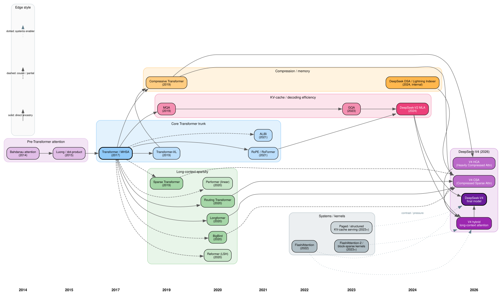

# DeepSeek-V4 Attention — Multi-Lane Genealogy DAG

A multi-lane DAG of the academic and engineering ancestry of DeepSeek-V4's
attention stack.

- **Solid edges** = direct ancestry
- **Dashed edges** = close cousin / partial influence
- **Dotted edges** = systems enabler / implementation pressure
- **Lanes** (top → bottom): pre-Transformer, core trunk, sparsity,
  compression/memory, KV-cache efficiency, systems/kernels, V4 culmination
- **X-axis** = year (left→right, 2014 → 2026)

The Graphviz source is at
[`deepseek-v4-genealogy.dot`](deepseek-v4-genealogy.dot).
Re-render with `dot -Tsvg deepseek-v4-genealogy.dot -o deepseek-v4-genealogy.svg`.

## One-sentence summary

DeepSeek-V4 attention is the merge of three families — Transformer
self-attention, long-context sparse / compressed memory, and KV-cache /
bandwidth-efficient decoding — with FlashAttention-style systems work
making it actually runnable.

## Shortest direct-ancestry path

Bahdanau → Luong → Transformer → Sparse Transformer / Longformer /
Routing Transformer → Compressive Transformer → MQA → GQA →
DeepSeek-V2 MLA → DeepSeek DSA / Lightning Indexer → V4 CSA → V4 HCA →
V4 hybrid attention → DeepSeek-V4.

## Closest parents vs cousins vs enablers

| relationship       | nodes                                                          |
|--------------------|----------------------------------------------------------------|
| **Closest parents** | DeepSeek-V2 MLA, Compressive Transformer, Routing Transformer, Longformer, MQA / GQA |
| **Important cousins** | BigBird, Sparse Transformer, Reformer, Performer, ALiBi |
| **Systems enablers**  | FlashAttention, block-sparse / IO-aware kernels, paged / structured KV-cache serving |

## Node list

### A. Pre-Transformer roots

- **N1 (2014) Bahdanau attention** — additive encoder-decoder attention; establishes "content-based retrieval over a sequence."
- **N2 (2015) Luong / dot-product attention** — multiplicative attention; closer precursor to scaled dot-product.

### B. Core Transformer trunk

- **N3 (2017) Transformer / multi-head self-attention** — main computation. All later nodes descend from here.
- **N4 (2019) Transformer-XL** — segment recurrence + relative positional scheme.
- **N5 (2021) RoPE / RoFormer** — rotary positional embedding; long-context extrapolation.
- **N6 (2021) ALiBi** — linear distance bias; length extrapolation cousin.

### C. Long-context sparsity

- **N7 (2019) Sparse Transformer** — fixed strided / factorized patterns.
- **N8 (2020) Longformer** — local sliding-window + selected global attention.
- **N9 (2020) BigBird** — local + random + global sparse pattern.
- **N10 (2020) Routing Transformer** — content-based sparse routing via clustering.
- **N11 (2020) Reformer** — LSH attention (cousin).
- **N12 (2020) Performer** — kernelized linear attention (cousin).

### D. Compression / memory

- **N13 (2019) Compressive Transformer** — recent + compressed older memory; closest conceptual precursor to V4's "compress distant, keep recent exact."
- **N14 (2024) DeepSeek DSA / Lightning Indexer line** — internal predecessor; V4 CSA compresses groups then applies DSA-style sparse selection over the compressed entries.

### E. KV-cache / decoding efficiency

- **N15 (2019) MQA** — share K/V across heads; reduces decode bandwidth.
- **N16 (2023) GQA** — interpolates MHA ↔ MQA.
- **N17 (2024) DeepSeek-V2 MLA** — low-rank latent KV compression; main direct V4 ancestor on the KV-efficiency side.

### F. Systems / kernels

- **N18 (2022) FlashAttention** — IO-aware exact attention kernel.
- **N19 (2023+) FlashAttention-2 / block-sparse kernels** — fast kernels for dense and sparse attention.
- **N20 (2023+) Paged / structured KV-cache serving** — deployment branch. V4's hybrid attention does **not** fit standard PagedAttention assumptions cleanly, so this is contrast / pressure as much as ancestry.

### G. DeepSeek-V4 culmination

- **N21 (2026) V4 CSA (Compressed Sparse Attention)** — compress K/V along sequence, then sparsely select relevant compressed entries; keeps local exact attention.
- **N22 (2026) V4 HCA (Heavily Compressed Attention)** — more aggressive compression, dense attention over compressed memory.
- **N23 (2026) V4 hybrid long-context attention** — interleaves CSA and HCA across layers.
- **N24 (2026) DeepSeek-V4 final model** — hybrid CSA/HCA + DeepSeekMoE + post-training.
