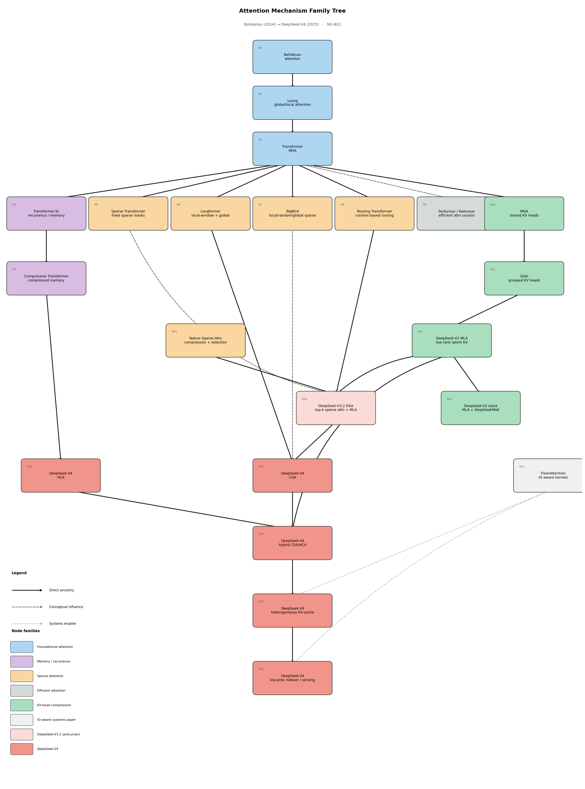

# attention-lineage

Family tree of attention mechanisms from Bahdanau (2014) through DeepSeek-V4 (2025),
rendered as a directed acyclic graph with three edge types.

## Legend

| Edge style | Meaning |
|---|---|
| **Solid** | Direct ancestry — one paper builds directly on another |
| **Dashed** | Conceptual influence — borrows ideas without strict descent |
| **Dotted** | Systems enabler — IO-aware implementation enabling the architecture |

Node colours indicate family:

| Colour | Family |
|---|---|
| Blue | Foundational attention (Bahdanau, Luong, Transformer MHA) |
| Purple | Memory / recurrence (Transformer-XL, Compressive Transformer) |
| Orange | Sparse attention (Sparse Transformer, Longformer, BigBird, Routing, Native Sparse) |
| Grey | Efficient attention cousins (Performer / Reformer) |
| Green | KV-head compression (MQA, GQA, DeepSeek-V2 MLA, DeepSeek-V2 stack) |
| Light grey | Systems / IO paper (FlashAttention) |
| Light salmon | DeepSeek-V3.2 precursor (DSA) |
| Salmon | DeepSeek-V4 cluster (CSA, HCA, hybrid, KV-cache, serving) |

## Structure

Three branches diverge from N2 (Transformer MHA) and converge at the DeepSeek-V4 cluster:

**Memory branch** (left): Transformer-XL → Compressive Transformer → HCA.
Extended recurrence and memory compression ideas feed directly into the HCA head design.

**Sparse branch** (centre): Sparse Transformer / Longformer / BigBird / Routing Transformer
→ Native Sparse Attention / DeepSeek-V3.2 DSA → DeepSeek-V4 CSA.
Content-based and structured-sparse routing is the conceptual spine of the CSA design.

**KV-head compression branch** (right): MQA → GQA → DeepSeek-V2 MLA.
Grouped and low-rank KV representations flow through DeepSeek-V2's MLA into both the
DSA precursor and directly into the V4 hybrid head.

**Systems enabler** (floating): FlashAttention / IO-aware kernels is independent of the
model-architecture lineage but is an enabling systems contribution for the heterogeneous
KV-cache layout (N20) and serving stack (N21).

## Nodes

| ID | Paper / technique |
|---|---|
| N0 | Bahdanau attention (2014) |
| N1 | Luong global/local attention (2015) |
| N2 | Transformer MHA (2017) |
| N3 | Transformer-XL recurrence / memory (2019) |
| N4 | Sparse Transformer fixed sparse masks (2019) |
| N5 | Compressive Transformer compressed memory (2019) |
| N6 | Longformer local-window + global attention (2020) |
| N7 | BigBird local/random/global sparse attention (2020) |
| N8 | Routing Transformer content-based sparse routing (2021) |
| N9 | Performer / Reformer efficient-attention cousins (2020–21) |
| N10 | MQA shared KV heads (2019) |
| N11 | GQA grouped KV heads (2023) |
| N12 | DeepSeek-V2 MLA low-rank latent KV compression (2024) |
| N13 | FlashAttention / IO-aware kernels (2022–23) |
| N14 | DeepSeek-V2 stack: MLA + DeepSeekMoE (2024) |
| N15 | Native Sparse Attention: compression + selection (2025) |
| N16 | DeepSeek-V3.2 DSA: top-k sparse attention under MLA (2025) |
| N17 | DeepSeek-V4 CSA |
| N18 | DeepSeek-V4 HCA |
| N19 | DeepSeek-V4 hybrid CSA/HCA |
| N20 | DeepSeek-V4 heterogeneous KV-cache layout |
| N21 | DeepSeek-V4 low-precision indexer / serving stack |

## Output



## Run

```bash
uv run attention_lineage.py
# or
python attention_lineage.py
```

Produces `attention_lineage.png` (150 DPI) and `attention_lineage.svg` in this directory.
Requires `matplotlib` only — no graphviz binary needed.
