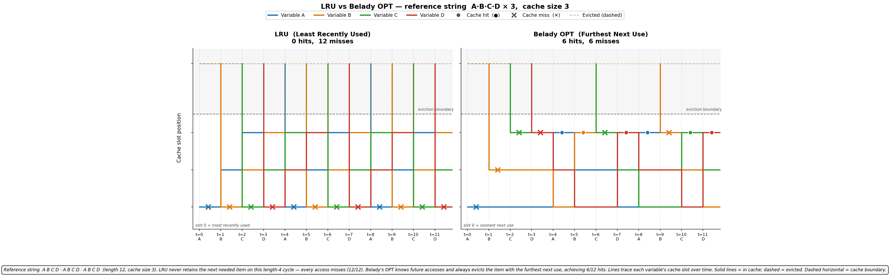

# optimal-cache-visualization

Side-by-side visualization of LRU and Belady OPT cache eviction on a
classic "LRU killer" reference string.

## What it shows

Reference string **A B C D × 3** (length 12), cache size 3.

| Policy | Hits | Misses |
|---|---|---|
| LRU (Least Recently Used) | 0 | 12 |
| Belady OPT (Furthest Next Use) | 6 | 6 |

LRU evicts the least-recently-used item. On a cyclic pattern of length
`k+1` over a cache of size `k`, it thrashes — the next item is always the
one it just evicted.

Belady's OPT knows future accesses and evicts the item with the furthest
next use. It avoids needless evictions and achieves the theoretical optimum.

## Visualization

Each colored line traces one variable's **cache slot position** over time
(X = time / access number, Y = cache slot).

- **Slot 0 (bottom)**: safest — most recently used (LRU) / soonest next use (OPT)
- **Slot k−1 (top of cache)**: eviction target
- **Above dashed line**: evicted (variable not in cache)
- **Solid line**: in cache; **dashed line**: evicted
- **Filled circle (●)**: cache hit; **✕**: cache miss



## Run

```bash
uv run lru_vs_opt_viz.py
# or
python lru_vs_opt_viz.py
```

Produces `lru_vs_opt.png` and `lru_vs_opt.svg` in this directory.
