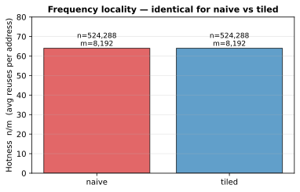
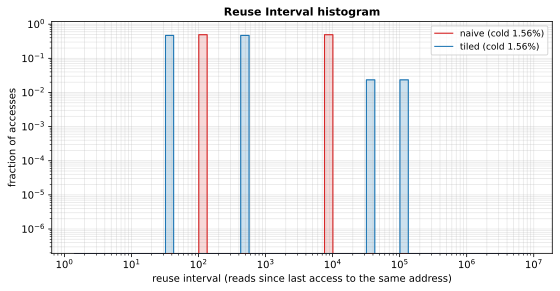
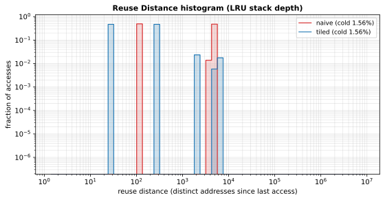
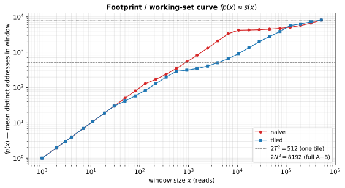
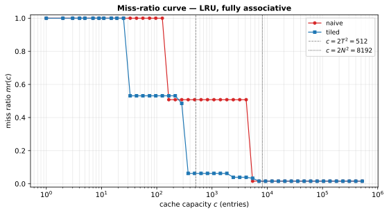
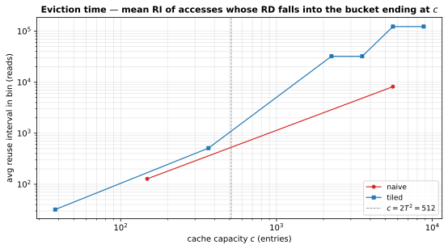

# Locality measures — naive vs tiled matmul

Implements every locality measure from [`gemini/locality-measures.md`](../../gemini/locality-measures.md) (Yuan et al., *A Relational Theory of Locality*) on the naive vs tiled $A \times B^T$ workload.

**Workload.** $N = 64$, $T = 16$, $N / T = 4$ tiles per axis. The trace is the sequence of read addresses, with matrix $A$ stored at addresses $[0, N^2)$ and matrix $B$ at $[N^2, 2N^2)$, and A-then-B reads interleaved per compute step. Trace length $n = 2 N^3 = 524{,}288$ reads over $m = 2 N^2 = 8{,}192$ distinct addresses.

Regenerate all plots with:

```bash
uv run --script visualize_locality.py
```

---

## 1. Frequency locality — hotness



**Definition.** $\text{hotness} = n / m$ — the average number of reuses per distinct address.

**Result.** Identical for both: $n/m = 64$, matching the inner-loop reuse count (each element of $A$ or $B$ is touched $N = 64$ times). This is the *Snir–Yu limit* from §2.6 of the paper: frequency is a pure multiset statistic and cannot distinguish the two algorithms, even though they differ by orders of magnitude in cache behaviour. Any locality theory that bottoms out at hotness is insufficient.

---

## 2. Access locality — reuse interval (RI)



**Definition.** At access $t$ of address $a$, $\text{RI}(t) = t - t_{\text{prev}(a)}$ — the number of reads since $a$ was last seen (logical time gap). First-touch accesses are cold and excluded (cold rate: $m / n = 1.56\%$ for both).

**Naive** concentrates at two spikes:

- $\text{RI} = 2N = 128$ from $A[i,k]$ reuse across consecutive $j$-iterations (the inner $k$-loop ends and the next $j$ iterates $N$ more reads before hitting the same $A$ cell).
- $\text{RI} = 2N^2 = 8{,}192$ from $B[j,k]$ reuse across consecutive $i$-iterations (the entire $j, k$ plane of $2N^2$ reads fires between consecutive uses of any $B$ cell).

**Tiled** collapses both spikes to smaller magnitudes — $A$ and $B$ reuses happen at the scale of a tile ($\lesssim 2T^2$) or a tile-band, not a full row/column, so the histogram mass shifts more than an order of magnitude to the left.

---

## 3. Access locality — reuse distance (RD)



**Definition.** $\text{RD}(t) =$ the number of *distinct* addresses touched since $a$'s previous access — equivalently, its LRU stack depth at the moment of reuse. Computed in $O(n \log n)$ via a Fenwick tree indexed by per-address monotone timestamps (grid's `walk_live_and_reuse` algorithm).

**Naive** spikes at RD $\approx N \approx 64$ (for $A$ reuses, since only $A$ row plus partial $B$ accumulate between uses) and at RD $\approx 2N^2 - \text{something} \approx 4{,}000$ (for $B$ reuses, since the entire $A$ row-band and $B$ matrix fill the stack).

**Tiled** packs essentially all reuses into RD $\le 2T^2 = 512$, the size of two live tiles. This is the key quantity the Miss-Ratio Curve consumes.

---

## 4. Timescale locality — footprint $fp(x)$



**Definition.** $fp(x) = \mathbb{E}[|{\text{distinct addrs in a length-}x\text{ window}}|]$, equivalent to Denning's average working-set size $s(x)$ under sliding windows. Computed exactly by sliding a deque over the trace at each $x$ on a log grid.

- **Naive**: $fp(x)$ rises near-linearly in $\log x$, climbing without a clear intermediate plateau until it saturates at $2N^2 = 8{,}192$ around $x \sim N^3$.
- **Tiled**: exhibits a pronounced **plateau near $2T^2 = 512$** stretching roughly $x \in [10^3, 10^4]$ — that's the working-set footprint of a single $(bi, bj, bk)$ block. This plateau is the hardware-locality signature and is exactly what makes the tile fit-and-stay in L1 / scratchpad.

This is the paper's conversion target: knowing $fp(x)$ is enough to derive the miss-ratio curve below via Denning–HOTL.

---

## 5. Cache locality — miss-ratio curve



**Definition.** $mr(c) = \Pr[\text{RD} > c \text{ or cold}]$ — the LRU fully-associative miss ratio at capacity $c$ (Mattson's stack algorithm). Derived in $O(n \log n)$ from the RD sequence by sorting.

The tiled curve has the **classical cliff at $c \approx 2T^2 = 512$**: $mr$ drops from $>50\%$ to $\approx 6\%$, because by then the cache holds both live tiles. The naive curve stays stuck near $50\%$ all the way to $c \approx 5{,}000$ — it needs essentially the entire $B$ matrix resident before hitting the low-miss regime.

Numerical summary:

| metric | naive | tiled | ratio |
|---|---|---|---|
| $mr(c{=}2T^2{=}512)$ | 50.8 % | **6.2 %** | 8.2× |
| $mr(c{=}2N^2{=}8192)$ | 1.6 % | 1.6 % | 1.0× (cold-only floor) |
| knee at $mr \approx 5\%$ | $c \approx 5{,}435$ | $c \approx 2{,}427$ | 2.2× smaller cache |

At a cache exactly sized to one tile-pair, tiling delivers the full order-of-magnitude win the algorithm exists to provide.

---

## 6. Cache locality — eviction time



**Definition.** For each capacity $c$, mean reuse interval among accesses whose RD falls into the bucket ending at $c$. Interpreted: if a cache of size $c$ is sitting on the cliff of just evicting an entry, this is the average logical time that entry waited before being kicked out — Denning's *expected eviction time*.

**Observations**:

- For $c \lesssim 2T^2$ both curves track together at low RI — any reuse that fits under this cache size is a short-term (intra-tile) reuse.
- Above $c \sim 2T^2$, tiled's curve jumps sharply to RI $\ge 10^4$: those are the *inter-tile* reuses (a $B$ tile reloaded across different $bi$ iterations), which the tiled schedule pushes far apart in time but keeps compactly in RD. Naive, by contrast, never exhibits such a gap — every reuse above the short-term cliff is directly interwoven.

The gap between the two curves near $c = 2T^2$ visualises the paper's *temporal margin*: tiled accesses that would miss at capacity $c$ are evicted after a much longer RI than naive ones, meaning the cache has more headroom.

---

## Summary

| measure | distinguishes? | why |
|---|---|---|
| frequency $n/m$ | no | multiset statistic, ignores order (Snir–Yu limit) |
| RI histogram | yes | spikes shift from $\{2N, 2N^2\}$ to $\{O(T), O(NT)\}$ |
| RD histogram | yes | mass moves below $2T^2$ |
| footprint $fp(x)$ | yes | tiled has a wide $2T^2$ plateau; naive does not |
| miss-ratio curve | yes | tiled has a cliff at $c = 2T^2$; naive's cliff is at $c \approx N^2$ |
| eviction time | yes | tiled pushes post-cliff RI to $\ge 10^4$, naive stays smooth |

The measures all agree on the ordering (tiled $\succ$ naive) but give quantitatively different views: RI / RD are per-access *distributions*, $fp(x)$ and $mr(c)$ are pooled *curves*, and eviction time is a *capacity-indexed expectation*. The paper's point is that these are convertible: the linear-time Xiang formula lets you derive $fp(x)$ from the RI histogram, and Denning–HOTL lets you derive $mr(c)$ from $fp(x)$ — so all of §2–§6 reduce to carrying one compact histogram through the pipeline.
